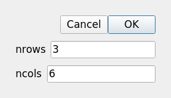
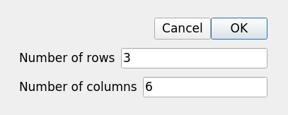
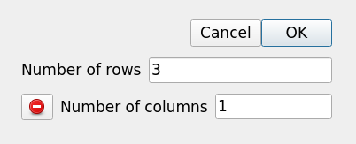
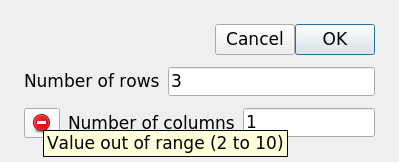

..
  
..
  SPDX-FileCopyrightText: © 2007-2023 Benedict Verhegghe <bverheg@gmail.com>
  SPDX-License-Identifier: GPL-3.0-or-later
  
  This file is part of pyFormex 3.3  (Sun Mar 26 20:16:15 CEST 2023)
  pyFormex is a tool for generating, manipulating and transforming 3D
  geometrical models by sequences of mathematical operations.
  Home page: https://pyformex.org
  Project page: https://savannah.nongnu.org/projects/pyformex/
  Development: https://gitlab.com/bverheg/pyformex
  Distributed under the GNU General Public License version 3 or later.
  
  This program is free software: you can redistribute it and/or modify
  it under the terms of the GNU General Public License as published by
  the Free Software Foundation, either version 3 of the License, or
  (at your option) any later version.
  
  This program is distributed in the hope that it will be useful,
  but WITHOUT ANY WARRANTY; without even the implied warranty of
  MERCHANTABILITY or FITNESS FOR A PARTICULAR PURPOSE.  See the
  GNU General Public License for more details.
  
  You should have received a copy of the GNU General Public License
  along with this program.  If not, see http://www.gnu.org/licenses/.
  
  
.. include:: defines.inc
.. include:: links.inc

.. _sec:input-dialogs:

Input Dialogs
=============

From the beginning pyFormex was intended as a framework for creating parametric
models. This means that some parameter values need to be fed to the models to
instantiate them. Often it is more appropriate to ask these values interactively
from the user, rather than hardcoding them into a script.

The pyFormex user has full access to the Qt framework on which the
GUI was built. Therefore he can built input dialogs as complex and
powerful as he can imagine. However, directly dealing with the
Qt libraries requires some skills and, for simple input widgets,
more effort than needed.

Therefore pyFormex has a very powerful but still easy to use system for
the creation of such dialogs. This document lays out the basic ideas of
the dialog creation and use. The examples named in parentheses are
available from the pyFormex menu Script->Scripts->userguide.

.. _sec:modal-dialogs:

Modal Dialogs
-------------
A modal dialog shows an input dialog to let the user enter some value(s),
and blocks all other user interaction with the application until the user
either accepts valid input or cancels (and rejects) the input. This is the
typical operation when the program needs some data from the user in order
to continue.

A simple dialog
...............

In many cases we can just make use of the :func:`gui.draw.askItems`
function.  Here's a simple example (dialog1):

.. literalinclude:: ../scripts/userguide/dialog1.py

The askItems function takes a list of input items as its first (and only
required) argument. Each input item is a dict where the keys have predefined
meanings. There are many optional keys, but at least the name and value keys
should be present. The whole dict should be acceptable as keyword arguments
for the :class:`gui.widgets.InputItem` class. See :ref:`sec:input-items`
for more details.

The name specifies the key in the result dict that will contain the value
entered by the user. The value is the initial value that will be displayed
when the dialog is first shown.
The value also serves in simple cases to identify the type
of the result: thus a str, int, float given as value will automatically
require that the same type is returned. If you want to get an integer back
as a string, you should specify: ``value='3'``.

The askItems function constructs a dialog, displays it to the user:

It then lets the user interact with the dialog until he either accepts
or rejects the input data. Accepting the data is done by clicking the OK
button or pressing the ENTER key. The data can be rejected by pushing the
CANCEL button or hitting the ESC key.
The dialog created by askItems is a modal one, meaning that all interaction
with the rest of the pyFormex interface is blocked until the user either
accepts or rejects the data. When the results are accepted or rejected, the
dialog is closed and the user can again interact with other pyFormex
windows. In :ref:`sec:modeless-dialogs` we describe how to create Dialogs
that can stay open and allow the user to interact with other windows.

The return value of askItems is always a dict.  If the user accepts
the data, the dict contains a value for each of the items specified,
with the name of the item as key.  The value will be of the type
implied by or specified in the input item. If the user rejects the
data, it will be an empty dict. It is good practice to always test the
result to see if it contains values, as is done in the example above.

If you run this example and accept the default values, you will see this
printed::

   [[ 0  1  2  3  4  5]
    [ 6  7  8  9 10 11]
    [12 13 14 15 16 17]]

Convenience functions
.....................

To avoid excessive typing and to make the structure of the dialog creating
source more clear, pyFormex offers some convenient shorthand functions:
_I, _G, _C and _T. We will use these abundantly in this user guide.

The most important is ``_I``, which creates a single input item, accepting
the name and value as positional arguments.
We will study this function in more detail in :ref:`sec:input-items`.
Using the ``_I`` function, we can simplify the dialog1 script to (dialog2):

.. literalinclude:: ../scripts/userguide/dialog2.py

The :code:`globals().update(res)` is a convenient shortcut to convert
all the values returned from the dialog to global variables. Of course
this only works if all the field names are valid Python variable names.
It is only recommended in small and simple scripts, where you can easily
avoid name clashes in the global name space.

Input validation
................

When an input item uses a string editing field as interactor, it is
usually not possible to type anything that would obviously lead to
an invalid value. For example, the integer input fields in the above
example will not allow you to enter a non-digit (except for the minus sign).

It is however still possible to have an invalid value in the
edit field. You can for example delete the input field contents: this has
to be possible in order to replace a value with another one. But the empty
string is not a valid integer. If this value would be accepted, the
remainder of the script would fail.

There are often more restrictions needed on the input values to
guarantee a proper operation. For example, in the dialog2 above,
it is possible to enter negative integers. If you only enter one negative
value, the script will still continue normally, producing an empty array.
If you enter both values negative though, the script exits with an
exception traceback. We could test the values nrows and ncols in the script,
and only proceed if the values are not negative. But pyFormex dialogs offer
a better way: specify the value bounds on the input item, and let the
pyFormex GUI handle the validation (dialog3):

.. _script_dialog3:
.. literalinclude:: ../scripts/userguide/dialog3.py

The min and max values specify the lowest and highest acceptable int value
for the field. For nrows, we accept any non-negative value. For ncols, we
restrict the values to the range 2..10. The *text* option in the input items
specifies the label displayed before the field. If *text* is not provided,
the field name is used instead, as in the previous dialogs. A final change
is that we use a ``print_array`` function to create and print the array.
By using the same argument names as the field names, we can easily process
the dialog results by unpacking them with :code:`**res`.

The dialog now looks like this:

While it is now impossible to enter negative values, specifying bounds
still leaves possibilities for intermediate invalid values. Take the
case of ncols, which specifies the range 2..10 as valid: it is possible
to enter a single ``1`` in the field, since that could be the first digit of
the valid number 10. Again, if this value would be accepted, an
invalid value would be produced.

The problem of intermediate invalid values is handled by pyFormex Dialogs as
follows: when the user performs an action to accept the dialog (pressing OK
or hitting ENTER), a validation of all data is performed, and if any fields
hold invalid data, these fields are flagged and the data is not accepted:

Hovering the mouse over the red invalid button will pop up a tip with the
reason:

Then the user interaction continues until all data are valid and accepted,
or the data are rejected.

.. _sec:modeless-dialogs:

Modeless Dialogs
----------------

:ref:`sec:modal-dialogs` are a good solution when some information from the
user is required to continue. But there are cases where we want to construct
a dialog that stays open while allowing to further interact with the other
windows. Such modeless dialogs need to be handled somewhat differently.
The system can not wait for results. Instead you will have to define actions
that are to be executed when activated, usually by clicking some button.

Here is the above dialog3 converted to a modeless dialog (dialog4):

.. literalinclude:: ../scripts/userguide/dialog4.py

The first function, ``create_array``, is the same as before
The next two functions are the actions that we want to be provided
by the dialog: ``show`` creates and prints the array with the current
input data; ``close`` just closes the dialog. The ``show`` function is
important here: it first validates the current input data. If these are
valid, they become available in a dict attribute ``results`` of the
dialog, so we can use that directly to proceed with our purpose.

Finally, we construct the Dialog. Its first argument specifies the input
items. This is exactly the same as the argument of
``askItems`` in `script_dialog3`_.
But we have a second keyword argument defining the actions to appear in the
dialog. This is a list of tuples defining pushbuttons (actually it is the
input for a :class:`ButtonBox` constructor.
Each button is defined by a tuple of a string and a function.
The string is the text shown on the button. The function should
take no arguments and will be executed when the button is pressed.

Now you can repeatedly change the input fields and click the ``Show``
button and see an array printed with the specified size. And when you're
done, click ``Close`` to close the window.

.. _sec:dialog-class:

Dialog class
------------
The Dialog class is the most important class in pyFormex for constructing
user input dialogs. It is very versatile and dialogs can range from very
simple to extremely comprehensive. In this user guide we will describe the
most commonly used features. See the :doc:`refman` for a full description.

Here is an example that is slightly more complex than the previous (dialog5):

.. literalinclude:: ../scripts/userguide/dialog5.py

.. _sec:input-items:

Input Items
-----------

.. End
